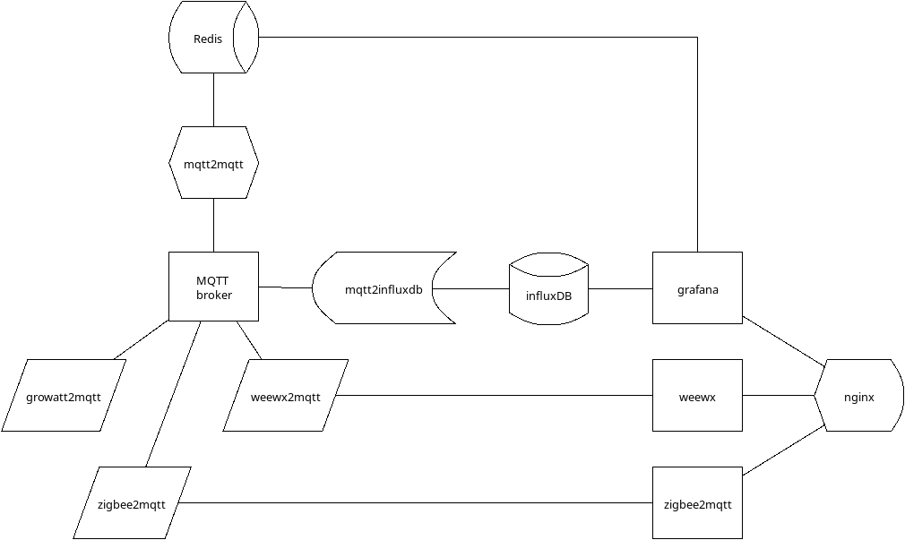

# h(e)ms

Home (Energy) Monitoring System

A DIM (do-it-myself) project...

I want a cheap generic IoT edge device with local analytical features.

I guess an Alpine Linux running in RUN-FROM-RAM mode will fit the bill as operating system. If not, I will use some Debian derivative. \
Will do a first run from a custom APKOVL and as podman's pod, both on x86 hardware. I have a dozen such x86_64 boxes lying around from previous project... \
Later on, I will try on Raspberry Pi and other ARM boards I have at the lab (the famous "Armada")...

I would love to add prediction capabilities based on forecasts, previous readings adapted to weather conditions and time of year...

## Architecture

